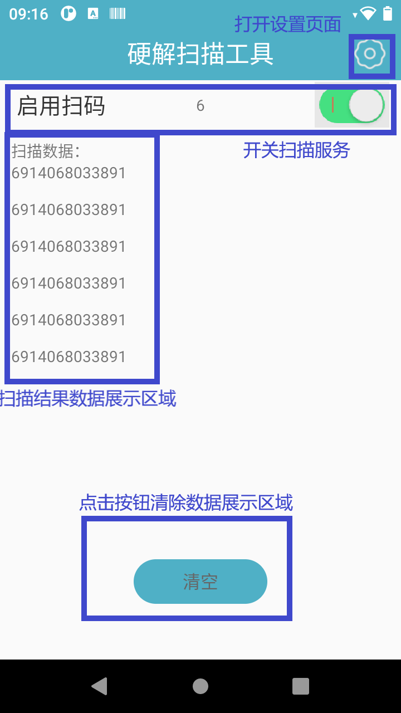
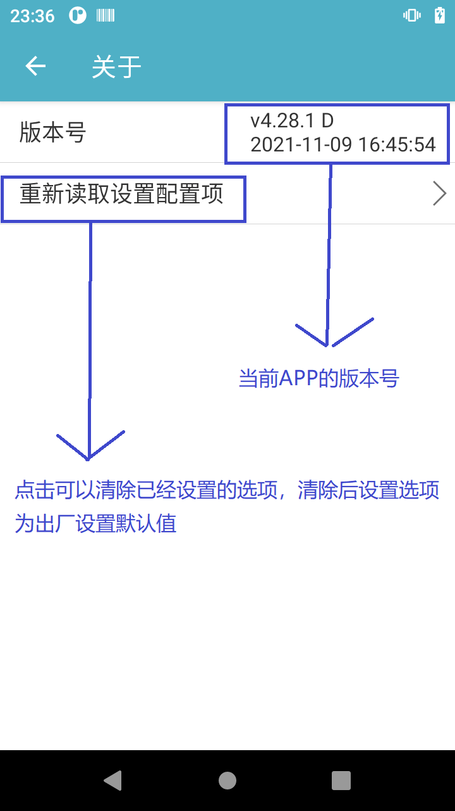
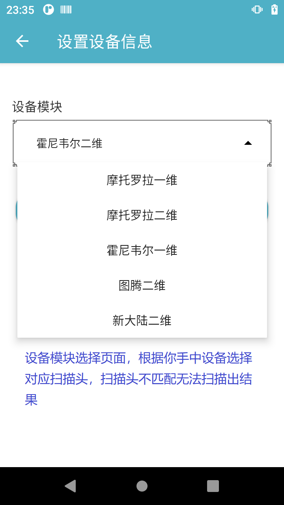

# 硬解使用说明文档

- 首页
    - 主要展示扫码结果，并可以清空扫码结果
- 设置
    - 自定义设置扫码选项
- 码制设置
    - 针对各个厂家支持的条码、二维码码制进行设置
- 模块切换
    - 针对平台上搭载的不同品牌不同型号的扫描头,需要适配不同的模块
    - 模块支持如下:

```
index 品牌   型号     条码/二维码     波特率
  1   MOTO  SE655     一维码        9600
  2   MOTO  2707      二维码        9600
  3   霍尼   4313      一维码        9600
  4   霍尼   N3680      二维码        115200
  4   霍尼   N4680      一/二维码     115200  
  5   图腾   E483      一/二维码     115200
  5   图腾   E660      一/二维码     115200
  6   新大陆  N1       一/二维码       9600   搭载在T195平台
```

483:支持安全等级 不支持中心扫码模式 多解码模式  
3680:支持 屏幕模式 居中模式 安全等级 不支持多解码

- 首页  
  
- 设置  
    
  

- symbologies 码制设置  
  注意事项:图腾是支持扫描头设置查询，所有设置项上面用绿色标记为当前设置项
  霍尔二维不支持设置查询，当设置命令发送成功后会有对应命令回显成功与否  
    
    
  
- 关于  
  
- 设置设备信息  
  

## 开发者说明

- 通过监听广播获取扫码数据 如果在[硬解扫描工具]中修改成自定义广播，需要修改成对应的广播action和data

```kotlin
val intentFilter = IntentFilter()
val action = "com.android.serial.BARCODEPORT_RECEIVEDDATA_ACTION"
val data = "DATA"
intentFilter.addAction(action)
registerReceiver(object : BroadcastReceiver() {
    override fun onReceive(context: Context, intent: Intent) {
        if (action == intent.action) {
            val data = intent.getStringExtra(data)
            Log.d("scan", "scanQrCode = [${data}]")
        }
    }
}, intentFilter)
```

- 自定义按键监听 查看设备中的扫码配置文件 /vendor/etc/scanner_config.xml buttons节点 id 为按键名
  openBroadcast 触发按键Down
  closeBroadcast 触发按键Up value =true 扫码APP会响应扫码动作，false 扫码APP不会响应扫码动作

```kotlin
val list = FileUtils.getBroadcastButton()
val buttonIntentFilter = IntentFilter()
buttonIntentFilter.addAction(list[0].openBroadcast)
buttonIntentFilter.addAction(list[0].closeBroadcast)
buttonIntentFilter.addAction("com.android.action.keyevent.KEYCODE_KEYCODE_SCAN_L_DOWN")
buttonIntentFilter.addAction("com.android.action.keyevent.KEYCODE_KEYCODE_SCAN_L_UP")
buttonIntentFilter.addAction("com.android.action.keyevent.KEYCODE_KEYCODE_SCAN_R_DOWN")
buttonIntentFilter.addAction("com.android.action.keyevent.KEYCODE_KEYCODE_SCAN_R_UP")
buttonIntentFilter.addAction("com.android.action.keyevent.KEYCODE_KEYCODE_SCAN_F_DOWN")
buttonIntentFilter.addAction("com.android.action.keyevent.KEYCODE_KEYCODE_SCAN_F_UP")
registerReceiver(object : BroadcastReceiver() {
    override fun onReceive(context: Context, intent: Intent) {
        if (list[0].openBroadcast == intent.action) {
            Log.d("scan", "${list[0].id} 按键 按下")
        } else if (list[0].closeBroadcast == intent.action) {
            Log.d("scan", "${list[0].id} 按键 抬起")
        }
    }
}, buttonIntentFilter)
```

- 发送扫码广播触发扫码  
  由于设备的多样性，请自行测试如下3条广播是否生效

```kotlin
sendBroadcast(Intent("com.android.action.keyevent.KEYCODE_KEYCODE_SCAN_L_DOWN"))
sendBroadcast(Intent("com.android.action.keyevent.KEYCODE_KEYCODE_SCAN_R_DOWN"))
sendBroadcast(Intent("com.android.action.keyevent.KEYCODE_KEYCODE_SCAN_F_DOWN"))
```

- adb 模拟触发扫码

```markdown
adb shell am broadcast -a com.android.action.keyevent.KEYCODE_KEYCODE_SCAN_L_DOWN  
adb shell am broadcast -a com.android.action.keyevent.KEYCODE_KEYCODE_SCAN_R_DOWN  
adb shell am broadcast -a com.android.action.keyevent.KEYCODE_KEYCODE_SCAN_F_DOWN
```

## WebSocket触发扫码 `ws://127.0.0.1:1234`

```markdown
连续扫码模式：发送字符串scan_start触发扫码，如果扫码成功，可从套接字中直接读取扫码结果，发送字符串scan_stop结束扫码。  
按下扫码松开停止模式：发送字符串scan_start触发扫码，如果扫码成功，可从套接字中直接读取扫码结果，发送字符串scan_stop结束扫码。  
按下扫码直到取得结果模式：发送字符串scan_start触发扫码，如果扫码成功，可从套接字中直接读取扫码结果，不支持主动结束扫码操作。
```

## WebSocket修改通用设置

```markdown
通过webSocket发送字符串settings:scanVoice=false,scanVibrate=false
表示关闭扫码提示音和扫码震动提示。  
后面内容可以根据实际需求组合搭配，其中更改字符串替换设置格式如下：settings:ReplaceChar=41>42&31>
32&37>33 表示将字符Ox41(A)替换为字符0x42(B)
,将字符Ox31(1)替换为字符0x32(2),将字符Ox37(7)替换为字符0x33(3)。  
后面内容可以根据实际需求组合搭配，更多组合项请参考下表。
```

## 发送广播修改通用设置

```markdown
通过广播携带具体的参数值即可实现设置项更改，例如下述示例表示将字符Ox41(A)替换为字符0x42(B)
,将字符Ox31(1)替换为字符0x32(2),将字符Ox37(7)
替换为字符0x33(3)  
adb shell am broadcast -a com.android.action.change.scan.settings --es settings "ReplaceChar=41=42&31=32&37=33"  
```

后面内容可以根据实际需求组合搭配，更多组合项请参考下表。

| key                  | value                                               | Description   |  
|:---------------------|:----------------------------------------------------|:--------------|
| scanVoice            | true/false                                          | 扫码声音开关        |
| scanVibrate          | true/false                                          | 扫码震动开关        |
| EnterChoose          | true/false                                          | 添加Enter后缀     |
| AUTO_CLEAN           | true/false                                          | 自动清空界面        |
| HidChoose            | true/false                                          | HID模式         |
| WidgetChoose         | true/false                                          | 控件模式          |
| ClipBoardChoose      | true/false                                          | 剪贴板           |
| BLUETOOTH            | true/false                                          | 蓝牙手柄开关        |
| TabSuffix            | ahead/behind/close                                  | 添加TAB         |
| ScanModel            | Async/Sync/Loop                                     | 扫码模式          |
| AddPrefix            | aa                                                  | 添加前缀          |
| AddSuffix            | bb                                                  | 添加后缀          |
| characterMode        | true/false                                          | 按位置截断字符串      |
| positionMode         | true/false                                          | 按字符截断字符串      |
| DeletePrefix         | 1                                                   | 删除前面1个字符      |
| DeleteSuffix         | 2                                                   | 删除后面2个字符      |
| DeletePrefixChar     | l                                                   | 删除字符l前的内容     |
| DeleteSuffixChar     | s                                                   | 删除字符s后的内容     |
| BaudRate             | 9600/115200                                         | 波特率选择         |
| FloatButton          | true/false                                          | 悬浮按钮开关        |
| FloatSize            | 0/1/2                                               | 悬浮按钮大小        |
| openServiceReboot    | true/false                                          | 服务开机自启        |
| FilterSpace          | true/false                                          | 过滤首尾空格        |
| ReplaceChar          | 41=42                                               | 字符替换(HEX)     |
| DataEncoding         | UTF-8                                               | 输出编码方式        |
| BroadcastAction      | com.android.serial.BARCODEPORT_RECEIVEDDATA_ACTION  | 接收扫码广播的Action |
| BroadcastData        | DATA                                                | 接收扫码广播的data   |
| overTime             | 1/2/3/4/5                                           | 连续扫码超时(百毫秒)   |
| VoiceIndex           | 0/1/2                                               | 提示音选择         |
| BlockVolumeKeys      | true/false                                          | 屏蔽音量键         |  
| ReplaceInvisibleChar | true/false                                          | 转换不可见字符       |  