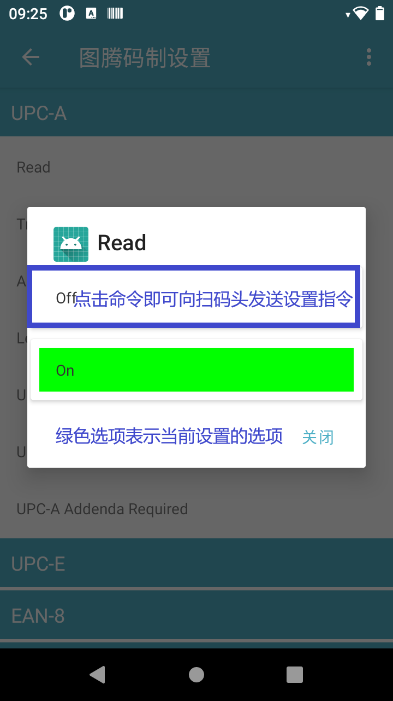

# Hard Decode User Manuals

- Home page
    - Mainly displays the scan results and can clear them
- Settings
    - Customise the scan setting options
- Symbologies Settings
    - Set the barcode and 2D code symbologies supported by each manufacturer
- Module switching
    - For different brands and models of scanner, different modules need to be chosen and adapted
    - The following modules are supported：

```
index Brand       Model     Barcode/2D code     BaudRate
  1   MOTO        SE655     1D code             9600
  2   MOTO        2707      2D code             9600
  3   Honeywell   4313      1D code             9600
  4   Honeywell   N3680     2D code             115200
  4   Honeywell   N4680     1D/2D code          115200  
  5   Totinfo     E483      1D/2D code          115200
  5   Totinfo     E660      1D/2D code          115200
  6   Newland     N1        1D/2D code          9600   with T195
```

483:Support Security level Not support Center scan mode and Multi-decode mode  
3680:Support Screen mode Centered mode Security level Not support Multi-decode

- Home page  
  
- Settings  
    
  

- symbologies settings  
  Note: Totinfo supports scanner setting query, and the current setting item is marked in all
  setting items
  Honeywell 2D does not support setting query, and when the setting command is sent successfully,
  there will be a corresponding command back to show the success or not  
    
    
  
- About  
  
- Device information setting  
  

## Developer Notes

- Get the scan data by listening to the broadcast If you modify it to a custom broadcast
  in [Hard Decode Scan Tool], you need to modify it to the corresponding broadcast action and data

```kotlin
val intentFilter = IntentFilter()
val action = "com.android.serial.BARCODEPORT_RECEIVEDDATA_ACTION"
val data = "DATA"
intentFilter.addAction(action)
registerReceiver(object : BroadcastReceiver() {
    override fun onReceive(context: Context, intent: Intent) {
        if (action == intent.action) {
            val data = intent.getStringExtra(data)
            Log.d("scan", "scanQrCode = [${data}]")
        }
    }
}, intentFilter)
```

- Custom button listener Check the scanner configuration file in the device
  /vendor/etc/scanner_config.xml buttons node id is the name of the button openBroadcast trigger
  button Down
  closeBroadcast triggers button Up value = true the app will respond to the code,
  false the app will not respond to the code

```kotlin
val list = FileUtils.getBroadcastButton()
val buttonIntentFilter = IntentFilter()
buttonIntentFilter.addAction(list[0].openBroadcast)
buttonIntentFilter.addAction(list[0].closeBroadcast)
buttonIntentFilter.addAction("com.android.action.keyevent.KEYCODE_KEYCODE_SCAN_L_DOWN")
buttonIntentFilter.addAction("com.android.action.keyevent.KEYCODE_KEYCODE_SCAN_L_UP")
buttonIntentFilter.addAction("com.android.action.keyevent.KEYCODE_KEYCODE_SCAN_R_DOWN")
buttonIntentFilter.addAction("com.android.action.keyevent.KEYCODE_KEYCODE_SCAN_R_UP")
buttonIntentFilter.addAction("com.android.action.keyevent.KEYCODE_KEYCODE_SCAN_F_DOWN")
buttonIntentFilter.addAction("com.android.action.keyevent.KEYCODE_KEYCODE_SCAN_F_UP")
registerReceiver(object : BroadcastReceiver() {
    override fun onReceive(context: Context, intent: Intent) {
        if (list[0].openBroadcast == intent.action) {
            Log.d("scan", "${list[0].id} Button Press")
        } else if (list[0].closeBroadcast == intent.action) {
            Log.d("scan", "${list[0].id} Button Lift")
        }
    }
}, buttonIntentFilter)
```

- Send a scan broadcast to trigger a scan   
  Due to the diversity of devices, please test yourself to see if the following 3 broadcasts work

```kotlin
sendBroadcast(Intent("com.android.action.keyevent.KEYCODE_KEYCODE_SCAN_L_DOWN"))
sendBroadcast(Intent("com.android.action.keyevent.KEYCODE_KEYCODE_SCAN_R_DOWN"))
sendBroadcast(Intent("com.android.action.keyevent.KEYCODE_KEYCODE_SCAN_F_DOWN"))
```

## adb Simulated trigger scan

```markdown
adb shell am broadcast -a com.android.action.keyevent.KEYCODE_KEYCODE_SCAN_L_DOWN  
adb shell am broadcast -a com.android.action.keyevent.KEYCODE_KEYCODE_SCAN_R_DOWN  
adb shell am broadcast -a com.android.action.keyevent.KEYCODE_KEYCODE_SCAN_F_DOWN
```

## WebSocket trigger scan `ws://127.0.0.1:1234`

```markdown
  Continuous scan mode: send the string 'scan_start' to trigger the scan. If the scan is successful,
the scan result can be read directly from the socket. Send the string 'scan_stop' to end the
scan.   
Press scan button and release to stop mode: send the string 'scan_start' to trigger the scan. If
the scan is successful, you can read the result directly from the socket. Send the string '
scan_stop' to end the scan.     
Press sweep until result mode: send the scan_start string to trigger the sweep, if the sweep is
successful, the result can be read directly from the socket, no active end of sweep operation is
supported.
```

## Change the general settings through the webSocket

```markdown
  Send the string format settings: scanVoice=false,scanVibrate=false through the webSocket to turn
off the scan sound and the scan vibrate prompt.  
The latter can be combined and matched according to actual needs, where the format of the string
replacement setting is as follows: settings:charReplace=41=42&31=32&37=33 means replace the
character Ox41(A) with the character 0x42(B)
,replace the character Ox31(1) with the character 0x32(2),replace the character Ox37(7) with the
character 0x33(3).  
For more combinations, please refer to the table below.
```

## Broadcast to change the general settings.

```markdown
  The settings can be changed by broadcasting specific parameter values, for example, the following
examples indicate that the character Ox41(A) is replaced by the character 0x42(B), the character
Ox31(1) is replaced by the character 0x32(2), the character Ox37(7)
for 0x33(3)  
adb shell am broadcast -a com.android.action.change.scan.settings --es settings "
ReplaceChar=41=42&31=32&37=33"
  ```

The latter content can be combined and matched according to actual needs, please refer to the
following table for more combination items.

| key                  | value                                                | Description                                    |  
|:---------------------|:-----------------------------------------------------|:-----------------------------------------------|
| scanVoice            | true/false                                           | Scan voice switch                              |
| scanVibrate          | true/false                                           | Scan vibrate switch                            |
| EnterChoose          | true/false                                           | Add Enter suffix                               |
| AUTO_CLEAN           | true/false                                           | Auto Clean Interface                           |
| HidChoose            | true/false                                           | HID                                            |
| WidgetChoose         | true/false                                           | EditText                                       |
| ClipBoardChoose      | true/false                                           | ClipBoard                                      |
| IntputMode           | 0(system broadcast)/1(clipboard)/2(input box)/3(HID) | Input Mode                                     |
| BLUETOOTH            | true/false                                           | Bluetooth Handle Switch                        |
| TabSuffix            | ahead/behind/close                                   | Add TAB                                        |
| ScanModel            | Async/Sync/Loop                                      | Scan mode                                      |
| AddPrefix            | aa                                                   | Add prefix                                     |
| AddSuffix            | bb                                                   | Add suffix                                     |
| characterMode        | true/false                                           | Truncate strings by position                   |
| positionMode         | true/false                                           | Truncate strings by character                  |
| DeletePrefix         | 1                                                    | Delete the first 1 character                   |
| DeleteSuffix         | 2                                                    | Delete the last 2 character                    |
| DeletePrefixChar     | l                                                    | Delete the content before the 1 character      |
| DeleteSuffixChar     | s                                                    | Delete the content after the s character       |
| BaudRate             | 9600/115200                                          | Baudrate Selection                             |
| FloatButton          | true/false                                           | Float button switch                            |
| FloatSize            | 0/1/2                                                | Float button size                              |
| openServiceReboot    | true/false                                           | Service boot self-start                        |
| FilterSpace          | true/false                                           | Delete first and last spaces                   |
| ReplaceChar          | 41=42                                                | Character replace(HEX)                         |
| DataEncoding         | UTF-8                                                | Output scan encoding                           |
| BroadcastAction      | com.android.serial.BARCODEPORT_RECEIVEDDATA_ACTION   | Receive the Action of scan broadcast           |
| BroadcastData        | DATA                                                 | Receive the data of scan broadcast             |
| overTime             | 1/2/3/4/5                                            | Continuous scan timeout (milliseconds)         |
| VoiceIndex           | 0/1/2                                                | Scan sound tone selection                      |
| BlockVolumeKeys      | true/false                                           | Block volume keys                              | 
| ReplaceInvisibleChar | true/false                                           | Convert Invisible Characters                   | 